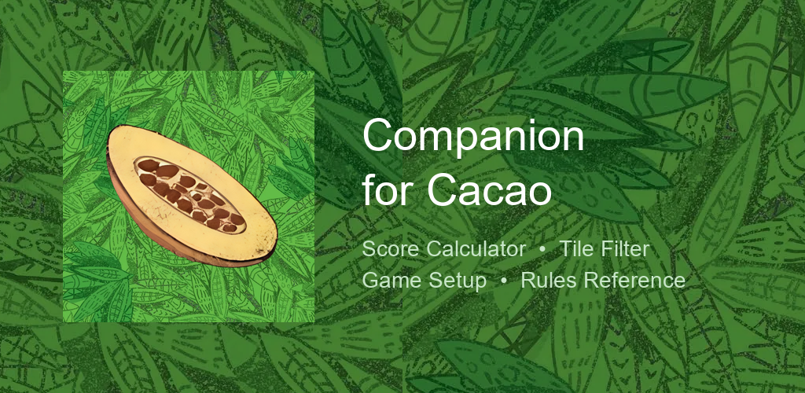
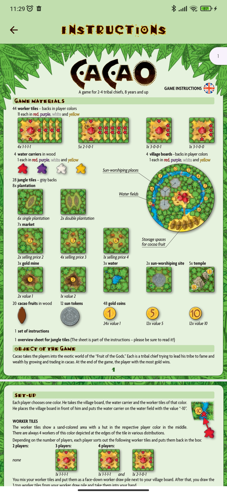
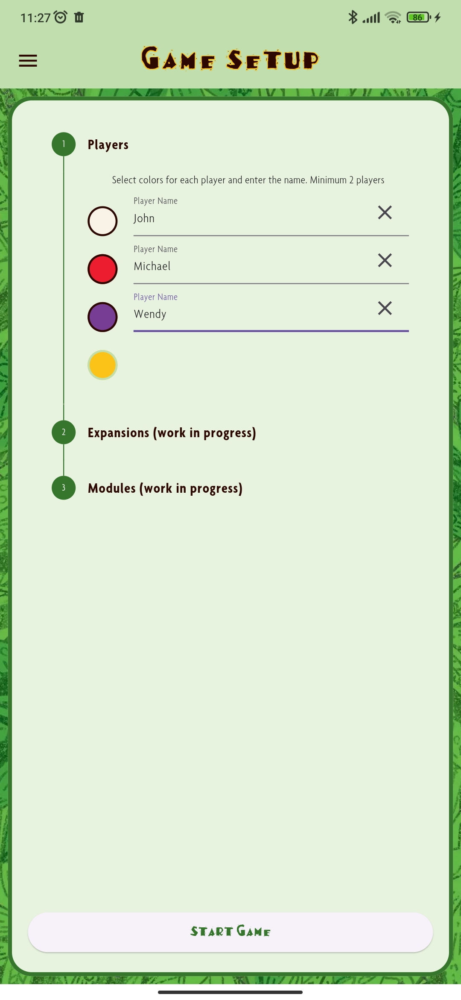
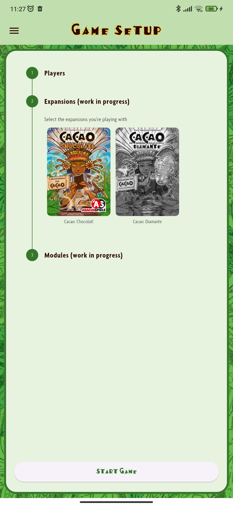
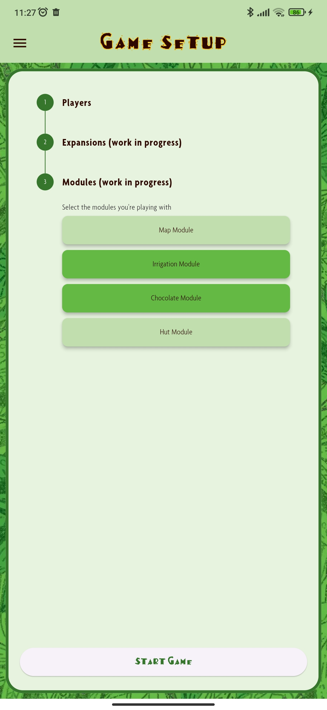
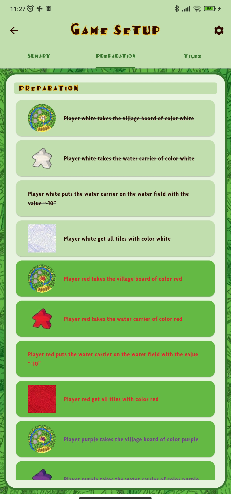
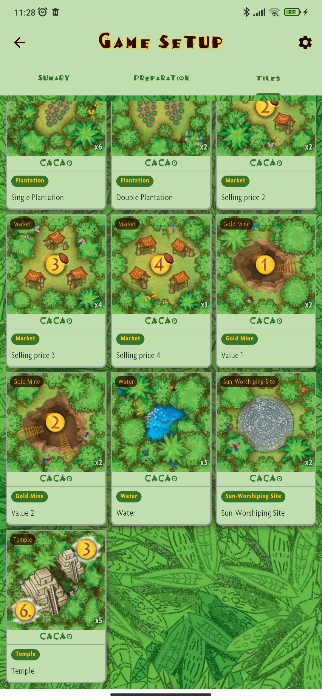
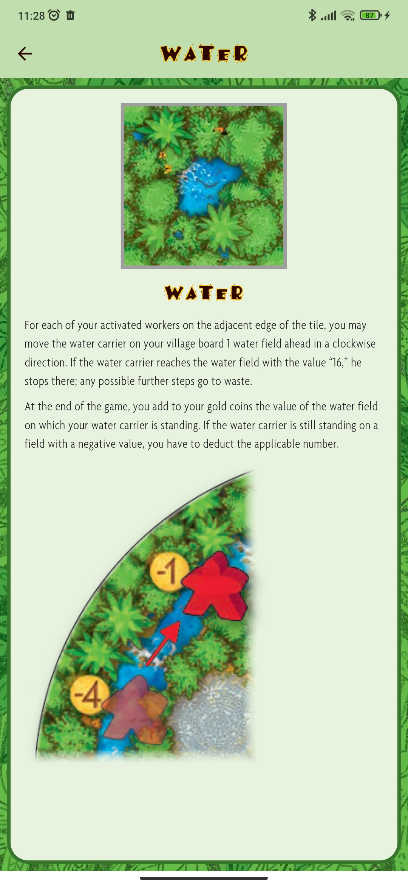
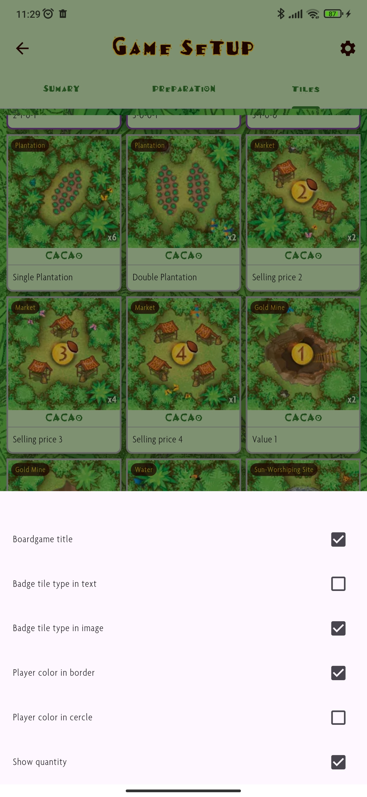

<div align="center">


# Companion for Cacao

**L'aplicació company per al joc de taula Cacao i les seves expansions**

[](https://flutter.dev)
[](https://dart.dev)
[](LICENSE)
[](https://play.google.com/store)
[]()

*Eines digitals per millorar l'experiencia de joc: preparacio de partides, consulta de regles i calcul de puntuacions.*



</div>

---

## Contingut

- [Sobre el Projecte](#sobre-el-projecte)
- [Screenshots](#screenshots)
- [Funcionalitats](#funcionalitats)
- [Tecnologia](#tecnologia)
- [Arquitectura](#arquitectura)
- [Començar](#comencar)
- [Estructura del Projecte](#estructura-del-projecte)
- [Full de Ruta](#full-de-ruta)
- [Convencions](#convencions)
- [Documentació](#documentacio)
- [Llicència](#llicencia)

---

## Sobre el Projecte

**Companion for Cacao** es una aplicacio mobil dissenyada per acompanyar els jugadors del joc de taula [Cacao](https://boardgamegeek.com/boardgame/171499/cacao) i les seves dues expansions oficials: **Chocolatl** i **Diamante**.

L'objectiu es proporcionar eines digitals que complementin l'experiencia de joc fisic — des de la preparacio inicial fins al calcul de la puntuacio final — sense substituir cap component fisic del joc.

### Per que aquesta app?

- **Preparacio rapida:** Configura partides en segons, amb seleccio automatica de rajoles segons jugadors, expansions i moduls actius.
- **Regles sempre a ma:** Consulta el manual complet sense haver de buscar el llibret de regles.
- **Cataleg de rajoles:** Explora totes les rajoles del joc amb imatges i descripcions detallades.
- **Calcul precis:** *(Properament)* Calculadora de puntuacio final amb suport per totes les expansions.

---

## Screenshots

<div align="center">

| | | | |
|:---:|:---:|:---:|:---:|
|  |  |  |  |
|  |  |  |  |

</div>

---

## Funcionalitats

### Disponibles (v2.1.0)

| Funcionalitat | Descripcio |
|---|---|
| **Menu Principal** | Navegacio rapida amb menu lateral tematic |
| **Base de Dades de Rajoles** | Cataleg complet amb imatges, descripcions i filtres de visualitzacio |
| **Filtrat de Rajoles** | Cerca i filtra rajoles per tipus, color i expansio |
| **Configuracio de Partida** | Dashboard amb resum, preparacio i rajoles en joc (joc base) |
| **Reordenacio de Jugadors** | Arrossega per canviar l'ordre dels jugadors |
| **Preparacio Automatica** | Visualitzacio pas a pas de la preparacio (joc base) |
| **Manual de Regles** | Visor PDF integrat del manual del joc base |
| **UI Adaptativa** | Layout optimitzat per a diferents mides de pantalla |
| **Notificador d'Actualitzacions** | Detecta automaticament noves versions al Play Store |

> Consulta el [Full de Ruta](#full-de-ruta) complet per a totes les fases.

---

## Tecnologia

| Component | Tecnologia | Versio |
|---|---|---|
| Framework | [Flutter](https://flutter.dev) | 3.41+ (SDK ^3.9.0) |
| Llenguatge | [Dart](https://dart.dev) | 3.11+ |
| Gestio d'Estat | [Riverpod](https://riverpod.dev) | 3.3+ |
| Navegacio | [GoRouter](https://pub.dev/packages/go_router) | 17+ |
| Base de Dades | [Drift](https://drift.simonbinder.eu) (SQLite) | 2.32+ |
| PDF | [Syncfusion PDF Viewer](https://pub.dev/packages/syncfusion_flutter_pdfviewer) | 32+ |
| Markdown | [flutter_markdown_plus](https://pub.dev/packages/flutter_markdown_plus) | 1.0+ |
| Linting | [flutter_lints](https://pub.dev/packages/flutter_lints) | 6.0+ |

---

## Arquitectura

L'aplicacio segueix els principis de **Clean Architecture** amb una organitzacio **feature-first** i el patro **MVVM**:

```
┌─────────────────────────────────────────┐
│              Presentacio                │
│   (Screens, Widgets, ViewModels)        │
├─────────────────────────────────────────┤
│                Domini                   │
│   (Entities, Use Cases, Notifiers)      │
├─────────────────────────────────────────┤
│                Dades                    │
│   (Models, Repositories, Data Sources)  │
├─────────────────────────────────────────┤
│            Infraestructura              │
│   (Drift DB, JSON, SharedPreferences)   │
└─────────────────────────────────────────┘
```

**Patrons utilitzats:**

- **MVVM** — Separacio clara entre vista i logica de negoci
- **Repository Pattern** — Abstraccio de les fonts de dades
- **UDF** (Unidirectional Data Flow) — Flux de dades predictible amb Riverpod

---

## Comencar

### Prerequisits

- [Flutter SDK](https://flutter.dev/docs/get-started/install) (^3.9.0)
- [Android Studio](https://developer.android.com/studio) o [VS Code](https://code.visualstudio.com/)
- Un dispositiu Android o emulador

### Installacio

```bash
# 1. Clonar el repositori
git clone https://github.com/isdabenx/companion_for_cacao.git
cd companion_for_cacao

# 2. Installar dependencies
flutter pub get

# 3. Generar codi de base de dades (Drift)
dart run build_runner build

# 4. Executar l'aplicacio
flutter run
```

---

## Estructura del Projecte

```
lib/
├── config/                 # Configuracio global
│   ├── constants/          # Assets i configuracions de rajoles
│   └── routes/             # Rutes de navegacio (GoRouter)
├── core/                   # Components transversals
│   ├── data/models/        # Models de dades (Drift)
│   ├── providers/          # Providers de base de dades
│   └── theme/              # Colors, tipografies i estils
├── features/               # Funcionalitats (feature-first)
│   ├── splash/             # Pantalla de carrega
│   ├── home/               # Menu principal
│   ├── tile/               # Cataleg de rajoles
│   ├── game_setup/         # Configuracio de partida
│   └── rule/               # Visor de regles
├── shared/                 # Components compartits
│   ├── providers/          # Notificadors globals
│   └── widgets/            # Ginys reutilitzables
└── main.dart               # Punt d'entrada
```

Cada feature segueix l'estructura interna:

```
feature/
├── presentation/           # Screens i widgets
├── domain/                 # Entities i logica de negoci
└── data/                   # Models i repositoris (si aplica)
```

---

## Full de Ruta

### Fase 1 — Funcionalitats Core

- [ ] Calculadora de puntuacio final
- [x] Filtre i cerca de rajoles
- [x] Selector de primer jugador
- [x] Notificacio d'actualitzacio de l'app (upgrader)
- [ ] Rajoles d'expansions completes (Chocolatl + Diamante)

### Fase 2 — Diferenciacio

- [ ] Historial de partides
- [ ] Perfils de jugador amb estadistiques
- [ ] Comptador de probabilitats de rajoles
- [ ] Foto de partida
- [ ] Gestor d'expansions millorat

### Fase 3 — Engagement

- [ ] Sistema d'assoliments
- [ ] Grups de joc amb classificacions
- [ ] Analisi post-partida
- [ ] Temporitzador de torns

### Fase 4 — Qualitat i Accessibilitat

- [ ] Mode daltonic
- [ ] Internacionalitzacio (catala, castella, angles)
- [ ] Configuracio general de l'app

> Per a detalls complets de cada funcionalitat, consulta [DESIGN.md](DESIGN.md).

---

## Convencions

| Element | Format | Exemple |
|---|---|---|
| Classes i Enums | `PascalCase` | `TileModel` |
| Metodes i Variables | `camelCase` | `calculateScore` |
| Arxius | `snake_case` | `app_routes.dart` |
| Sufixos | Segons tipus | `*_model.dart`, `*_provider.dart`, `*_screen.dart`, `*_widget.dart` |

**Commits:** [Conventional Commits](https://www.conventionalcommits.org/) amb [Gitmoji](https://gitmoji.dev/) (ex: `feat: :sparkles: add score calculator`).

---

## Documentacio

- **[DESIGN.md](DESIGN.md)** — Document de disseny complet: regles del joc, expansions, models de dades i arquitectura
- **[Politica de Privadesa](docs/privacy-policy.html)** — Politica de privadesa per a Google Play

---

## Llicencia

Aquest projecte esta llicenciat sota la **Creative Commons Attribution-NonCommercial-ShareAlike 4.0 International**.

Pots copiar, redistribuir i adaptar el material sempre que:

- Atribueixis l'autoria original
- No el facis servir amb fins comercials
- Distribueixis les teves contribucions sota la mateixa llicencia

Consulta l'arxiu [LICENSE](LICENSE) per als termes complets.

---

<div align="center">

Fet amb :chocolate_bar: per [isdabenx](https://github.com/isdabenx)

*Companion for Cacao no esta afiliat ni avalat pels creadors del joc de taula Cacao.*

</div>
